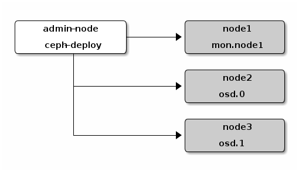

## openshift实践-持久化存储

官网文档：https://docs.openshift.com/enterprise/3.1/install_config/persistent_storage/persistent_storage_ceph_rbd.html

### ceph 集群部署

ceph上当前非常流行的开源分布式存储解决方案. Ceph是一个可靠地、自动重均衡、自动恢复的分布式存储系统，根据场景划分可以将Ceph分为三大块，分别是对象存储、块设备存储和文件系统服务。
Ceph 独一无二地用统一的系统提供了对象、块、和文件存储功能，它可靠性高、管理简便、并且是自由软件。 Ceph 的强大足以改变贵公司的 IT 基础架构、和管理海量数据。 Ceph 可提供极大的伸缩性——供成千用户访问 PB 乃至 EB 级的数据。 Ceph 节点以普通硬件和智能守护进程作为支撑点， Ceph 存储集群组织起了大量节点，它们之间靠相互通讯来复制数据、并动态地重分布数据.

#### 环境准备
系统：ubuntu 16.04

172.16.130.11 node1

172.16.130.12 node2

172.16.130.13 node3

节点角色：

```
admin-node, deploy-node(ceph-deploy)：172.16.130.11 node1
mon.node1，(mds.node1): 172.16.130.11  node1
osd.0: 172.16.130.12 node2
osd.1: 172.16.130.13 node3
```

Ceph分布式存储集群由若干组件组成，包括：Ceph Monitor、Ceph OSD和Ceph MDS，其中如果你仅使用对象存储和块存储时，MDS不是必须的（本次我们也不需要安装MDS），仅当你要用到Cephfs时，MDS才是需要安装的。

Ceph的安装模型是通过一个deploy node远程操作其他Node以create、prepare和activate各个Node上的Ceph组件，官方手册中给出的示意图如下




部署之前需要解决几个问题

1. ntp 部署

2. hostname设置

3. ssh 免密登录

Ceph提供了一键式安装工具ceph-deploy来协助Ceph集群的安装，在deploy node上，我们首先要来安装的就是ceph-deploy
默认的源比较老, 我们需要添加Ceph源，安装最新的ceph-deploy：

```
# wget -q -O- 'https://download.ceph.com/keys/release.asc' | sudo apt-key add -
OK

echo deb https://download.ceph.com/debian-jewel/ $(lsb_release -sc) main | sudo tee 

apt-get update && apt-get install ceph-deploy


```

注意： 如果我们使用普通用户，在ceph-deploy真正执行安装之前，需要确保所有Ceph node都要开启NTP，同时建议在每个node节点上为安装过程创建一个安装账号，即ceph-deploy在ssh登录到每个Node时所用的账号。这个账号有两个约束
	
	具有sudo权限；
	执行sudo命令时，无需输入密码
```
以下命令在每个Node上都要执行：

useradd -d /home/cephd -m cephd
passwd cephd

添加sudo权限：
echo "cephd ALL = (root) NOPASSWD:ALL" | sudo tee /etc/sudoers.d/cephd
sudo chmod 0440 /etc/sudoers.d/cephd
```

#### 部署ceph


##### ceph install node

如果之前安装过ceph，可以先执行如下命令以获得一个干净的环境：

```
ceph-deploy purgedata node1 node2 node3
ceph-deploy forgetkeys
ceph-deploy purge node1 node2 node3
```

接下来我们就可以来全新安装Ceph了。在deploy node上，建立ceph install目录，然后进入ceph install目录执行相关步骤。

我们首先来创建一个ceph cluster，这个环节需要通过执行ceph-deploy new {initial-monitor-node(s)}命令。按照上面的安装设计，我们的ceph monitor node就是node1，因此我们执行下面命令来创建一个名为ceph的ceph cluster：

```
$ mkdir my-cluster && cd my-cluster
$ ceph-deploy new node1
```

new命令执行完后，ceph-deploy会在当前目录下创建一些辅助文件:

```
root@node1:~/my-cluster# ls -alh
total 112K
drwxr-xr-x  3 root root 4.0K Jun 12 16:10 .
drwx------ 30 root root 4.0K Jun 12 15:18 ..
-rw-------  1 root root   71 Jun 12 15:19 ceph.bootstrap-mds.keyring
-rw-------  1 root root   71 Jun 12 15:19 ceph.bootstrap-osd.keyring
-rw-------  1 root root   71 Jun 12 15:19 ceph.bootstrap-rgw.keyring
-rw-------  1 root root   63 Jun 12 15:19 ceph.client.admin.keyring
-rw-r--r--  1 root root  253 Jun 12 15:18 ceph.conf
-rw-r--r--  1 root root  72K Jun 12 15:30 ceph-deploy-ceph.log
-rw-------  1 root root   73 Jun 12 15:15 ceph.mon.keyring


### 这是我修改之后的ceph.conf

root@node1:~/my-cluster# cat ceph.conf
[global]
fsid = b20b5e7b-9518-4500-acc9-de2ee642f47a
mon_initial_members = node1
mon_host = 172.16.130.11
auth_cluster_required = cephx
auth_service_required = cephx
auth_client_required = cephx


## 这些是我们手动加上去，因为ceph推荐使用xfs文件系统，但是我们使用ext4文件系统
osd max object name len = 256 
osd max object namespace len = 64

## 默认pool 是 3
osd pool default size = 2

```

由于我们仅有两个OSD节点，因此我们在进一步安装之前，需要先对ceph.conf文件做一些配置调整：
修改配置以进行后续安装：

```
在[global]标签下，添加下面一行：
osd pool default size = 2
```
接下来，我们执行下面命令在node1和node2上安装ceph运行所需的各个binary包：

```
ceph-deploy install nod1 node2 node3
```

这一过程ceph-deploy会SSH登录到各个node上去，执行apt-get update, 并install ceph的各种组件包，这个环节耗时可能会长一些（依网络情况不同而不同），请耐心等待。


##### 初始化ceph monitor node

有了ceph启动的各个程序后，我们首先来初始化ceph cluster的monitor node。在deploy node的工作目录cephinstall下，执行：

```
# ceph-deploy mon create-initial

[ceph_deploy.conf][DEBUG ] found configuration file at: /root/.cephdeploy.conf
[ceph_deploy.cli][INFO  ] Invoked (1.5.35): /usr/bin/ceph-deploy mon create-initial
[ceph_deploy.cli][INFO  ] ceph-deploy options:
[ceph_deploy.cli][INFO  ]  username                      : None
[ceph_deploy.cli][INFO  ]  verbose                       : False
[ceph_deploy.cli][INFO  ]  overwrite_conf                : False
[ceph_deploy.cli][INFO  ]  subcommand                    : create-initial
[ceph_deploy.cli][INFO  ]  quiet                         : False
[ceph_deploy.cli][INFO  ]  cd_conf                       : <ceph_deploy.conf.cephdeploy.Conf instance at 0x7f0f7ea2fe60>
[ceph_deploy.cli][INFO  ]  cluster                       : ceph
[ceph_deploy.cli][INFO  ]  func                          : <function mon at 0x7f0f7ee93de8>
[ceph_deploy.cli][INFO  ]  ceph_conf                     : None
[ceph_deploy.cli][INFO  ]  default_release               : False
[ceph_deploy.cli][INFO  ]  keyrings                      : None
[ceph_deploy.mon][DEBUG ] Deploying mon, cluster ceph hosts node1
[ceph_deploy.mon][DEBUG ] detecting platform for host node1...
[node1][DEBUG ] connected to host: node1
[node1][DEBUG ] detect platform information from remote host
[node1][DEBUG ] detect machine type
```

这一过程很顺利。命令执行完成后我们能看到一些变化：

在当前目录下，出现了若干*.keyring，这是Ceph组件间进行安全访问时所需要的,在node1(monitor node)上，我们看到ceph-mon已经运行起来了：

```
root@node1:~/my-cluster$ ps -ef|grep ceph
ceph     32326     1  0 14:19 ?        00:00:00 /usr/bin/ceph-mon --cluster=ceph -i node1 -f --setuser ceph --setgroup ceph
```

##### prepare ceph OSD node

至此，ceph-mon组件程序已经成功启动了，剩下的只有OSD这一关了。启动OSD node分为两步：prepare 和 activate。OSD node是真正存储数据的节点，我们需要为ceph-osd提供独立存储空间，一般是一个独立的disk。但我们环境不具备这个条件，于是在本地盘上创建了个目录，提供给OSD。

```
在deploy node上执行：

ssh node2
sudo mkdir /var/local/osd0
exit

ssh node3
sudo mkdir /var/local/osd1
exit
```

接下来，我们就可以执行prepare操作了，prepare操作会在上述的两个osd0和osd1目录下创建一些后续activate激活以及osd运行时所需要的文件：

```
ceph-deploy osd prepare node2:/var/local/osd0 node3:/var/local/osd1
```
这时候osd 进程不会去启动

##### 激活ceph OSD node

接下来，来激活各个OSD node

```
ceph-deploy osd activate node2:/var/local/osd0 node3:/var/local/osd1
```


执行ceph admin:


```
ceph-deploy admin node1 node2 node3
```

接下来，查看一下ceph集群中的OSD节点状态：

```
root@node1:~/my-cluster# ceph osd tree
ID WEIGHT  TYPE NAME      UP/DOWN REWEIGHT PRIMARY-AFFINITY
-1 0.36499 root default
-2 0.18250     host node2
 0 0.18250         osd.0       up  1.00000          1.00000
-3 0.18250     host node3
 1 0.18250         osd.1       up  1.00000          1.00000


root@node1:~/my-cluster# ceph -s
    cluster b20b5e7b-9518-4500-acc9-de2ee642f47a
     health HEALTH_OK
     monmap e1: 1 mons at {node1=172.16.130.11:6789/0}
            election epoch 3, quorum 0 node1
     osdmap e11: 2 osds: 2 up, 2 in
            flags sortbitwise,require_jewel_osds
      pgmap v2213: 64 pgs, 1 pools, 37572 kB data, 18 objects
            37414 MB used, 318 GB / 373 GB avail
                  64 active+clean
root@node1:~/my-cluster# ceph health
HEALTH_OK
root@node1:~/my-cluster#
```

##### 遇到的问题


1. 权限问题

```
node1][WARNIN] 2018-6-12 14:25:40.325075 7fd1aa73f800 -1  ** ERROR: error creating empty object store in /var/local/osd0: (13) Permission denied
[node1][WARNIN]
[node1][ERROR ] RuntimeError: command returned non-zero exit status: 1
[ceph_deploy][ERROR ] RuntimeError: Failed to execute command: /usr/sbin/ceph-disk -v activate --mark-init upstart --mount /var/local/osd0
```
osd0被root拥有，ceph-deploy是以ceph用户启动的ceph-osd程序自然没有权限在/var/local/osd0目录下创建文件并写入数据了。这个问题在ceph官方issue中有很多人提出来，也给出了临时修正方法：

```
将osd0和osd1的权限赋予ceph:ceph：

node2：
sudo chown -R ceph:ceph /var/local/osd0

node3：
sudo chown -R ceph:ceph /var/local/osd1

```

2. ceph使用ext4文件系统的问题

错误日志

```
2018-6-12 15:13:47.138895 7f568d6db800  1 journal close /var/lib/ceph/osd/ceph-0/journal
2018-6-12 15:13:47.140041 7f568d6db800 -1  ** ERROR: osd init failed: (36) File name too long
```

官方不建议采用ext4文件系统作为ceph的后端文件系统，如果采用，那么对于ext4的filesystem，应该在ceph.conf中添加如下配置：

```
osd max object name len = 256
osd max object namespace len = 64
```

####  k8s（openshift）使用rbd

为什么k8s需要RBD呢？以前用到的volume，有 configmap 、empty dir、hostpath，configmap通常是用来向容器注入配置的，而empty dir、hostpath 也能够用来存储数据，但他们都有一个致命的问题：如果容器被删除了，数据也就跟着丢失了。这对一些无状态应用来说没什么，因为他们的数据可能早就进数据库了，但对一些有状态的应用来说（比如说mysql），就是个问题了。

Ceph RBD、Cephfs，都是解决这个问题的办法。

Ceph RBD是个什么东西呢？

我们知道，存储可以分为三类：对象存储（例如aws s3、aliyun oss）、文件存储（例如nfs、nas）、块存储。而Ceph RBD(RADOS Block Devices)即为块存储的一种，下文的Cephfs则是文件存储的一种。

下面简要走一下ceph RBD的使用

##### rdb 用作 volume 挂载

RBD基本使用：用户在Ceph上创建Pool（逻辑隔离），然后在Pool中创建image（实际存储介质 object），之后再将image挂载到本地服务器的某个目录上。

下面常用几条命令就行了。

```
# rbd list    #列出默认pool下的image
# rbd list -p k8s   #列出pool k8s下的image
# rbd create foo -s 1024  #在默认pool中创建名为foo的image，大小为1024MB
# rbd map foo #将ceph集群的image映射到本地的块设备, 正常给k8s或者openshift使用不需要map
```

Kubernetes的官方源码的examples/volumes/rbd目录下，就有一个使用cephrbd作为kubernetes pod volume的例子；

例子提供了两个pod描述文件：rbd.json和rbd-with-secret.json。由于我们在ceph install时在ceph.conf中使用默认的安全验证协议cephx – The Ceph authentication protocol了：

```
auth_cluster_required = cephx
auth_service_required = cephx
auth_client_required = cephx
```
下面是例子volumes部分
```
"volumes": [
            {
                "name": "rbdpd",
                "rbd": {
                    "monitors": [
                           "10.16.154.78:6789",
                           "10.16.154.82:6789",
                           "10.16.154.83:6789"
                                 ],
                    "pool": "kube",
                    "image": "foo",
                    "user": "admin",
                    "secretRef": {
                           "name": "ceph-secret"
                                         },
                    "fsType": "ext4",
                    "readOnly": true
                }
```
olumes部分是和ceph rbd紧密相关的一些信息，各个字段的大致含义如下：

name：volume名字，这个没什么可说的，顾名思义即可。

rbd.monitors：前面提到过ceph集群的monitor组件，这里填写monitor组件的通信信息，集群里有几个monitor就填几个；
rbd.pool：Ceph中的pool记号，它用来给ceph中存储的对象进行逻辑分区用的。默认的pool是”rbd”；
rbd.image：Ceph磁盘块设备映像文件；
rbd.user：ceph client访问ceph storage cluster所使用的用户名。ceph有自己的一套user管理系统，user的写法通常是TYPE.ID，比如client.admin（是不是想到对应的文件：ceph.client.admin.keyring）。client是一种type，而admin则是user。一般来说，Type基本都是client。
secret.Ref：引用的k8s secret对象名称。

上面的字段中，有两个字段值我们无法提供：rbd.image和secret.Ref,我们在root用户下建立k8s-cephrbd工作目录，我们首先需要使用ceph提供的rbd工具创建Pod要用到image：
上面都是在默认pool中做的，我们在k8s（openshift）里，当然要用自己的pool了。

```
# ceph osd lspools # 看看已经有那些pool
# ceph osd pool create k8s 128 #创建pg_num 为128的名为k8s的pool
# rados df

# rbd list    #列出默认pool下的image
# rbd list -p k8s   #列出pool k8s下的image

#有了自己专属的 pool以后，创建image
# rbd create foobar -s 1024 -p k8s #在k8s pool中创建名为foobar的image，大小为1024MB
```
另外给openshift使用不需要挂载image

前面已经创建好了image foobar，给volume用简单直接挂就行了。

接下来我们来创建ceph-secret这个k8s secret对象，这个secret对象用于k8s volume插件访问ceph集群：

获取client.admin的keyring值，并用base64编码：

```
# ceph auth get-key client.admin
AQBiKBxYuPXiJRAAsupnTBsURoWzb0k00oM3iQ==

# echo "AQBiKBxYuPXiJRAAsupnTBsURoWzb0k00oM3iQ=="|base64
QVFCaUtCeFl1UFhpSlJBQXN1cG5UQnNVUm9XemIwazAwb00zaVE9PQo=

```
在k8s-cephrbd下建立ceph-secret.yaml文件，data下的key字段值即为上面得到的编码值：

```
//ceph-secret.yaml

apiVersion: v1
kind: Secret
metadata:
  name: ceph-secret
data:
  key: QVFCaUtCeFl1UFhpSlJBQXN1cG5UQnNVUm9XemIwazAwb00zaVE9PQo=
```

创建ceph-secret：

```
# kubectl create -f ceph-secret.yaml
secret "ceph-secret" created

# kubectl get secret
NAME                  TYPE                                  DATA      AGE
ceph-secret           Opaque                                1         16s
```

创建pod挂载volumes
```
apiVersion: v1
kind: Pod
metadata:
  name: rbd
spec:
  containers:
    - image: nginx
      name: rbd-rw
      volumeMounts:
      - name: rbdpd
        mountPath: /mnt/rbd
  volumes:
    - name: rbdpd
      rbd:
        monitors:
        - '172.16.130.11:6789'
        pool: k8s
        image: foobar
        fsType: ext4
        readOnly: false
        user: admin
        //keyring: /etc/ceph/ceph.client.admin.keyring 
        secretRef: {
                        "name": "ceph-secret"
                        },
```

创建成功可以看到如下信息：

1. pod正常创建
2. rbd正常挂载
3. pod里面/mtn 正常挂载

```

[root@localhost ceph]# oc get pods
NAME      READY     STATUS    RESTARTS   AGE
rbd       1/1       Running   0          6m
[root@localhost ceph]# mount | grep rbd
/dev/rbd1 on /var/lib/origin/openshift.local.volumes/plugins/kubernetes.io/rbd/rbd/rbd-image-foo type ext4 (rw,relatime,stripe=1024,data=ordered)
/dev/rbd1 on /var/lib/origin/openshift.local.volumes/pods/78f8f235-6ed6-11e8-aef5-0800272eeb78/volumes/kubernetes.io~rbd/rbdpd type ext4 (rw,relatime,stripe=1024,data=ordered)
[root@localhost ceph]# oc get pods
NAME      READY     STATUS    RESTARTS   AGE
rbd       1/1       Running   0          6m
[root@localhost ceph]# oc exec -it rbd bash
root@rbd:/# df -h
Filesystem           Size  Used Avail Use% Mounted on
overlay               36G   17G   19G  49% /
tmpfs                1.9G     0  1.9G   0% /dev
tmpfs                1.9G     0  1.9G   0% /sys/fs/cgroup
/dev/mapper/cl-root   36G   17G   19G  49% /etc/hosts
/dev/rbd1            976M  1.3M  908M   1% /mnt/rbd
shm                   64M     0   64M   0% /dev/shm
tmpfs                1.9G   16K  1.9G   1% /run/secrets/kubernetes.io/serviceaccount
tmpfs                1.9G     0  1.9G   0% /proc/scsi
tmpfs                1.9G     0  1.9G   0% /sys/firmware
```


问题：
map操作报错。不过从错误提示信息，我们能找到一些蛛丝马迹：“RBD image feature set mismatch”。ceph新版中在map image时，给image默认加上了许多feature，通过rbd info可以查看到：

```
# rbd info foo
rbd image 'foo':
    size 1024 MB in 256 objects
    order 22 (4096 kB objects)
    block_name_prefix: rbd_data.10612ae8944a
    format: 2
    features: layering, exclusive-lock, object-map, fast-diff, deep-flatten
    flags:
```
可以看到foo image拥有： layering, exclusive-lock, object-map, fast-diff, deep-flatten。不过遗憾的是我的Ubuntu 16.04的内核仅支持其中的几个feature，其他feature概不支持。我们需要手动disable这些features：
```
# rbd feature disable foo exclusive-lock, object-map, fast-diff, deep-flatten
root@node1:/var/log/ceph# rbd info foo
rbd image 'foo':
    size 1024 MB in 256 objects
    order 22 (4096 kB objects)
    block_name_prefix: rbd_data.10612ae8944a
    format: 2
    features: layering
    flags:
```
不过每次这么来disable可是十分麻烦的，一劳永逸的方法是在各个cluster node的/etc/ceph/ceph.conf中加上这样一行配置：

```
rbd_default_features = 1 #仅是layering对应的bit码所对应的整数值
```
设置完后，通过下面命令查看配置变化：


```
# ceph --show-config|grep rbd|grep features
rbd_default_features = 1
```


##### rbd 用作 PV/PVC

volume是一种比较初级的使用方式，中级的方式是使用PV/PVC。

简单说说PV/PVC。集群管理员会创建多个PV（Persist Volume，持久化卷，不区分namespace），而普通用户会创建PVC（PV Claim，PV声明），k8s会从满足PVC的要求中选择一个PV来与该PVC绑定，之后再将PV对应的image挂载到容器中。

来看个例子。

先在rbd(默认) pool里创建一个名为pv的 image。

```
rbd create pv -s 1024
```

再创建一个PV，使用上面创建的image pv。

```
cat ceph-rbd-pv.yaml

apiVersion: v1
kind: PersistentVolume
metadata:
  name: ceph-rbd-pv
spec:
  capacity:
    storage: 1Gi
  accessModes:
    - ReadWriteOnce
  rbd:
    monitors:
      - '1.2.3.4:6789'
    pool: k8s
    image: pv
    user: admin
    secretRef:
      name: ceph-secret
    fsType: ext4
    readOnly: false
  persistentVolumeReclaimPolicy: Recycle
```

看下现在pv的状态，还是 Available。
```
[root@localhost ceph]# oc create -f ceph-rdb-pv.yaml
persistentvolume "ceph-rbd-pv" created
[root@localhost ceph]# oc get pv
NAME          CAPACITY   ACCESS MODES   RECLAIM POLICY   STATUS      CLAIM     STORAGECLASS   REASON    AGE
ceph-rbd-pv   1Gi        RWO            Recycle          Available                                      4s
```
创建一个PVC，要求一块1G的存储。

```
apiVersion: v1
kind: PersistentVolumeClaim
metadata:
  name: ceph-rbd-pv-claim
spec:
  accessModes:
    - ReadWriteOnce
  resources:
    requests:
      storage: 1Gi
```
因为上面已经创建满足要求的PV了，可以看到pvc和pv的状态都已经是Bound了。

```
[root@localhost ceph]# oc get pv
NAME          CAPACITY   ACCESS MODES   RECLAIM POLICY   STATUS    CLAIM                                   STORAGECLASS   REASON    AGE
ceph-rbd-pv   1Gi        RWO            Recycle          Bound     openshift-ansible-service-broker/etcd                            2m
```

##### rdb 用作 storage class

为什么前面说PV/PVC是一个“中级”解决方案呢？

很简单啊，管理员不可能没事就等着给人创建RBD image、PV，而一次创建大量PV等着人用又显得很不云计算

简单来说，storage创建需要的材料，只需要访问ceph RBD的IP/Port、用户名、keyring、pool，不需要提前创建image；当用户创建一个PVC时，k8s查找是否有符合PVC请求的storage class类型，如果有，则依次：

	1. 到ceph集群上创建image
	2. 创建一个PV，名字为pvc-xx-xxx-xxx，大小pvc请求的storage。
	3. 将上面的PV与PVC绑定，格式化后挂到容器中

是不是很简单？管理员只要创建好storage class就行了，后面的事情用户自己就可以搞定了。当然了，为了防止流氓用户，设置一下Resource Quota还是很有必要的。

先创建一个SC。根PV一样，SC也是集群范围的（RBD认为是fast的）。

```
kind: StorageClass
apiVersion: storage.k8s.io/v1
metadata:
  name: fast
provisioner: kubernetes.io/rbd
parameters:
  monitors: 172.16.130.11:6789
  adminId: admin
  adminSecretName: ceph-secret
  adminSecretNamespace: test
  pool: rbd
  userId: admin
  userSecretName: ceph-secret
  fsType: ext4
  imageFormat: "1"
  imageFeatures: "layering"
```

之后创建应用的时候，需要同时创建 pvc+pod，二者通过claimName关联。pvc中需要指定其storageClassName为上面创建的sc的name（即fast）

```
kind: PersistentVolumeClaim
apiVersion: v1
metadata:
  name: test
spec:
  accessModes:
    - ReadWriteOnce
  volumeMode: Filesystem
  resources:
    requests:
      storage: 1Gi
  storageClassName: fast

```
创建完可以看到pv,pvc,sc完成完美绑定

```
[root@localhost ceph]# oc get pvc
^[[ANAME              STATUS    VOLUME                                     CAPACITY   ACCESS MODES   STORAGECLASS   AGE
rbd-pvc-pod-pvc   Bound     pvc-d98e98c5-6ee5-11e8-aef5-0800272eeb78   1Gi        RWO            dynamic        17m
test              Bound     pvc-a84a145e-6ee6-11e8-aef5-0800272eeb78   1Gi        RWO            fast           11m
[root@localhost ceph]# oc get pv
NAME                                       CAPACITY   ACCESS MODES   RECLAIM POLICY   STATUS    CLAIM                                   STORAGECLASS   REASON    AGE
ceph-rbd-pv                                1Gi        RWO            Recycle          Bound     openshift-ansible-service-broker/etcd                            1h
pvc-a84a145e-6ee6-11e8-aef5-0800272eeb78   1Gi        RWO            Delete           Bound     test/test                               fast                     11m
pvc-d98e98c5-6ee5-11e8-aef5-0800272eeb78   1Gi        RWO            Delete           Bound     test/rbd-pvc-pod-pvc                    dynamic                  17m
[root@localhost ceph]# oc get sc
NAME                PROVISIONER         AGE
dynamic (default)   kubernetes.io/rbd   18m
fast                kubernetes.io/rbd   12
```

在ceph集群可以看到image（object）创建成功
```
root@node1:~/my-cluster# rbd list
kubernetes-dynamic-pvc-a84d82d6-6ee6-11e8-b584-0800272eeb78
kubernetes-dynamic-pvc-d991e392-6ee5-11e8-b584-0800272eeb78
foo
pv
pvs
```

遇到问题：

1. secret  获取不到
```
povision volume with StorageClass "fast": failed to get admin secret from ["test"/"ceph-secret"]: failed to get secret from ["test"/"ceph-secret"]
```
解决方案，把secret创建到指定的namespaces下面

2. rbd 调用命令失败

```
rbd: extraneous parameter --image-feature
  Warning  ProvisioningFailed  8s  persistentvolume-controller  Failed to provision volume with StorageClass "dynamic": failed to create rbd image: exit status 1, 

```
解决方案: 把sc imageFormat改成1就ok。
原因： openshit 默认装的ceph太老了，把ceph升级到

下面是我openshift环境
```
[root@localhost ceph]# oc version
oc v3.9.0+ba7faec-1
kubernetes v1.9.1+a0ce1bc657
features: Basic-Auth GSSAPI Kerberos SPNEGO

Server https://192.168.1.90:8443
openshift v3.9.0+ba7faec-1
kubernetes v1.9.1+a0ce1bc657
[root@localhost ceph]# rbd version
2018-06-13 04:57:58.195065 7f9b6c3c47c0 -1 did not load config file, using default settings.
rbd: error parsing command 'version'; -h or --help for usage
[root@localhost ceph]# rbd --version
ceph version 0.94.5 (9764da52395923e0b32908d83a9f7304401fee43)
```
下面是我们ceph集群的环境
```
root@node1:~/my-cluster# ceph --version
ceph version 10.2.9 (2ee413f77150c0f375ff6f10edd6c8f9c7d060d0)
```
发现版本不一致，而且openshift中的ceph环境太老了


##### 使用StatefulSet解决多副本的问题

下面使用StatefulSet创建多副本

```
apiVersion: apps/v1
kind: StatefulSet
metadata:
  name: nginx
spec:
  selector:
    matchLabels:
      app: nginx
  serviceName: "nginx"
  replicas: 3
  template:
    metadata:
      labels:
        app: nginx
    spec:
      terminationGracePeriodSeconds: 10
      containers:
      - name: nginx
        image: nginx
        volumeMounts:
        - name: www
          mountPath: /usr/share/nginx/html
  volumeClaimTemplates:
  - metadata:
      name: www
    spec:
      accessModes: [ "ReadWriteOnce" ]
      storageClassName: "fast"
      resources:
        requests:
          storage: 1Gi
```
此时去看PVC，可以看到创建了3个PVC。

```
[root@localhost ceph]# oc get pvc | grep www
www-nginx-0       Bound     pvc-2422b493-6ee9-11e8-aef5-0800272eeb78   1Gi        RWO            fast           4m
www-nginx-1       Bound     pvc-62291d14-6ee9-11e8-aef5-0800272eeb78   1Gi        RWO            fast           2m
[root@localhost ceph]# oc get pvc | grep www
www-nginx-0       Bound     pvc-2422b493-6ee9-11e8-aef5-0800272eeb78   1Gi        RWO            fast           4m
www-nginx-1       Bound     pvc-62291d14-6ee9-11e8-aef5-0800272eeb78   1Gi        RWO            fast           2m

```


